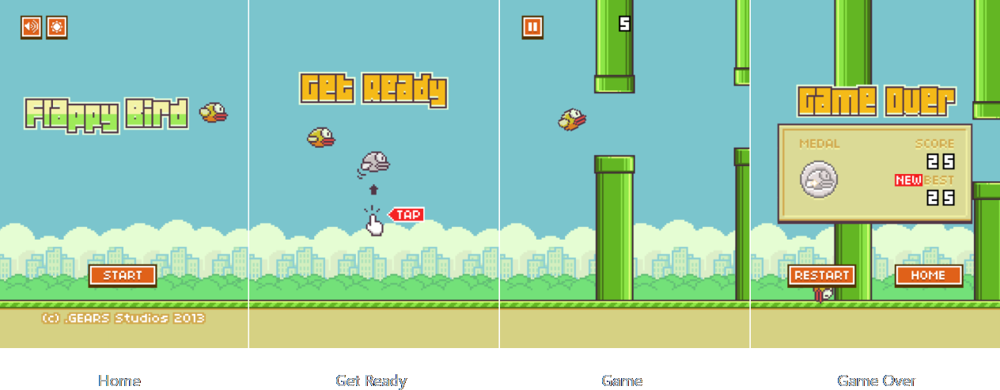

<p align="center">
  
</p>

# Flappy Bird
This is a Flappy Bird clone built with HTML5 canvas and vanilla JavaScript. You can play play it [here](https://mmarqs.github.io/FlappyBird/). Additionally, further down in this README is a list of [Game Controls](#game-controls).


## About the game
Flappy Bird was a side-scrolling game developed by the Vietnamese Dong Nguyen, under his game development company [dotGEARS](https://dotgears.com).

The game's goal is to guide a flying bird as it moves to the right, while avoiding sets of pipes. To keep the bird airborne, the player must tap, causing the bird to briefly flap. If the player doesn't tap, the bird falls due to gravity. The player earns one point each time the bird flies through a pair of pipes. 

Medals are awarded based on the player's final score. Scores between 10 and 20 earn a bronze medal, while a silver medal is awarded for scores of 20 or higher. A gold medal is given to those who score above 30 points, and players who achieve a score of 40 or higher receive a planinum medal.


## Implementations

### Physics & Coordinate Mapping
The game physics rely on a 2D cartesian coordinate mapping system that correlates directly with pixel vectors relative to the canvas origin. Each object has an instance variable of x,y position coordinates that can be directly associated with a pixel vector in relation to the canvas origin. 

It is important to mention that since the canvas origin is in the upper left corner, the ```y``` coordinate value increases from top to bottom on the canvas.

### Main functions
- ```draw()``` - It's responsible for drawing the game objects on the canvas. It's a method present in all objects in the game, which draws the element of the respective object using its properties.

- ```update()``` - It's responsible for updating the game objects on the canvas. It's present in some game objects, wich updates the bird's position in all game states, foreground's positon and pipes' position. It also updates the random position of medal's shining animation on Game Over state.

- ```loop()``` - This function is used to run the game loop. It runs every 1/75th of a second so that regardless of each player's computer update rate, the game has a fixed update rate of 75FPS. It calls ```update()``` and ```draw()```, thus updating the game state and rendering graphics, respectively. Frames are only incremented if the game isn't paused. This function also calls ```requesteAnimationFrame(loop)``` to continue the loop on the next frame.

- ```canvasScale()``` - It's responsible for adjusting the canvas size according to the browser's window size, using the ```clientWidth``` and ```clientHeight``` properties of the document object. In addition, it also sets the canvas scale so that the graphic elements are drawn with the same proportion in different resolutions. This function is called when the window is loaded or resized.

### Collisions
Explicit hitboxes weren't used to detect collisions. Instead, a check was made to evaluate whether or not the bird's ```x``` and ```y``` coordinates  were overlappinping the pipes or foreground ```x``` and ```y``` coordinates.

The bird's collision with the pipes or foreground is performed every frame. If the bird's position overlaps any part of the pipes or foreground, a collision is detected. In this case, the game ends.


## Game States
- **Home** - Game's initial state, where the player can start the game, mute or unmute the sound and activate or deactivate the night mode.
- **Get Ready** - Where the player is about to start the game.
- **Game** - Game's main state, where the player flies with the bird. In this state the player must avoid colliding with a set of pipes or with the foreground and try to get the best score.
- **Game Over** - The game is over because the player collided with a pipe or with the foreground. In this state the player's score and best score are shown with the option to restart the game or to return to Home state.
<p align="center">
  
</p>


## Game controls
#### Mouse
- All buttons in the game can be clicked with the mouse.
#### Keyboard
- You can use the ```n``` key at any time to activate/deactivate the site's night mode.
- During the game state, you can use the following keys:
    - ```space``` - Make the bird flap
    - ```p``` - Pause/Resume the game


## Acknowledgements
- [Figma](https://www.figma.com): This vector graphic and prototyping design tool was used to create and edit the sprite sheet for the game, and measure the coordinates and dimensions of each object in the sprite sheet.

- [flappybird.ee](https://flappybird.ee): This website was used as a reference for scaling most of the elements and the game itself.

- [CodeExplainedRepo](https://github.com/CodeExplainedRepo): The structure of the code was inspired by his tutorial provided on GitHub.
